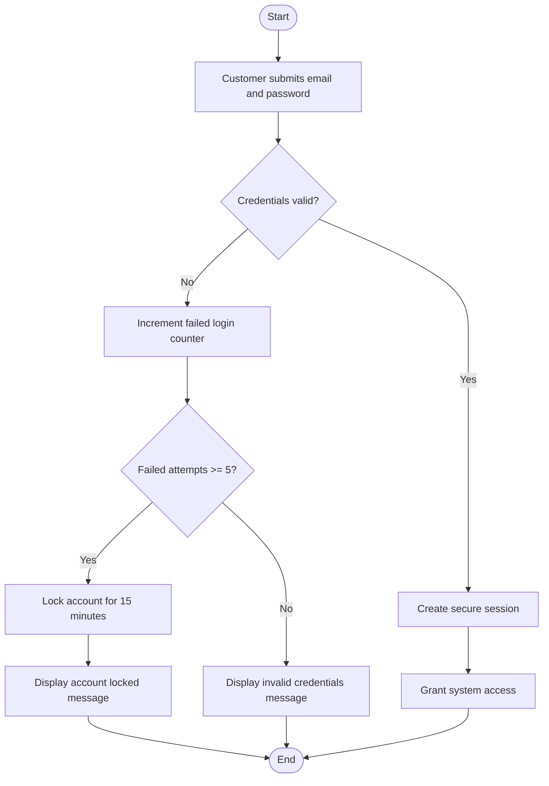
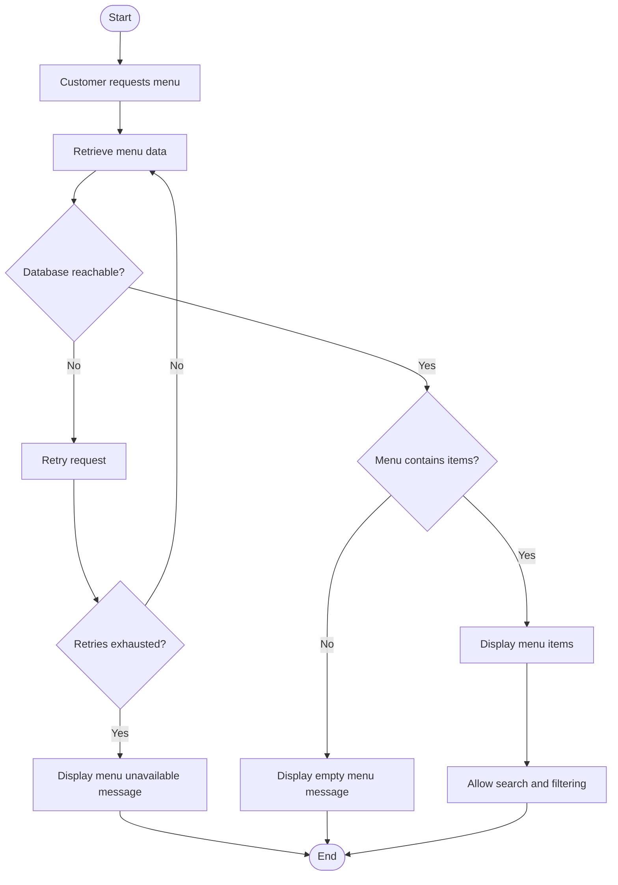
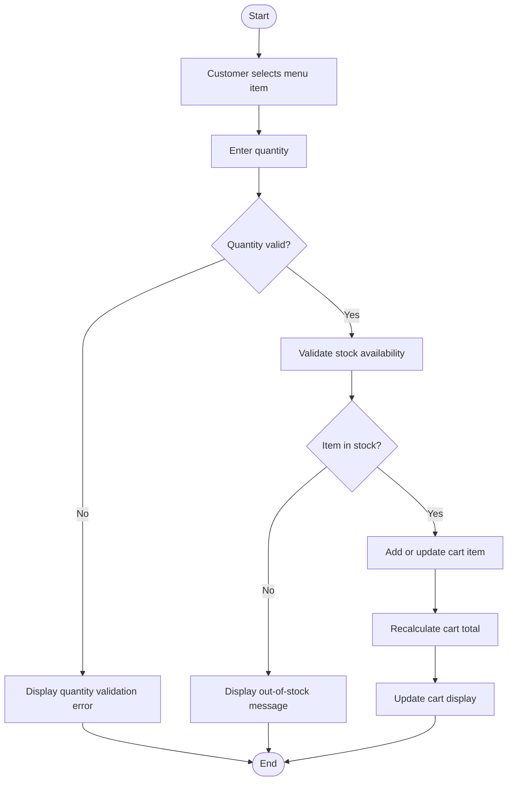
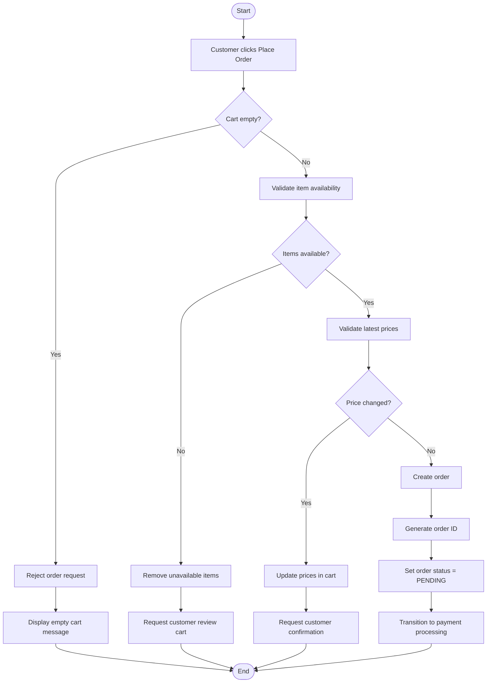
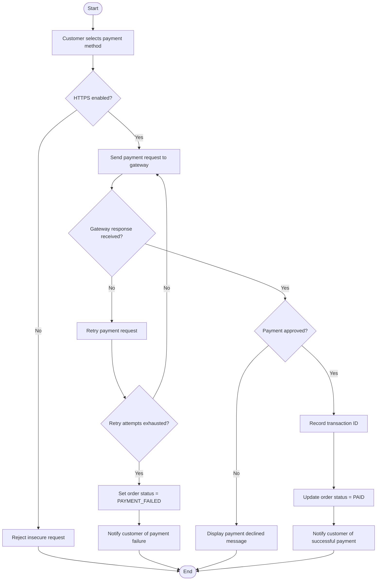
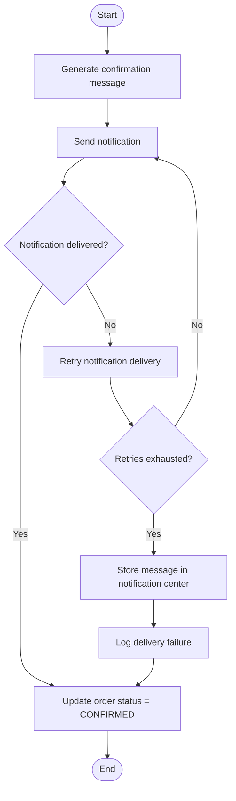
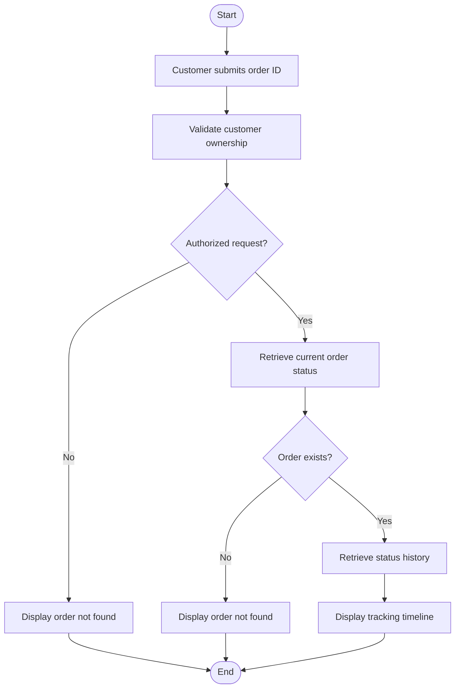

# Activity Diagrams

This document provides the Activity Diagrams for the Customer Ordering System.

The diagrams model:

* workflow behavior
* decision points
* validation logic
* alternate flows
* retry handling
* failure recovery

The activity diagrams are derived from:

* requirements and use cases
* edge case analysis
* system sequence diagrams
* UML class diagram

---

# AD-UC1 — Authentication

---

# AD-UC2 — Browse Menu

---

# AD-UC3 — Manage Cart

---

# AD-UC4 — Place Order

---

# AD-UC5 — Process Payment

---

# AD-UC6 — Send Confirmation

---

# AD-UC7 — Track Order

---

# Design Notes

## Purpose of Activity Diagrams

The activity diagrams model the behavioral workflow of the system.

They describe:

* execution flow
* decisions
* branching logic
* retries
* validation behavior
* operational failure handling

Unlike SSDs, activity diagrams focus on process logic and workflow transitions.

---

## Relationship to Use Cases

Each activity diagram corresponds directly to a use case:

* UC1 → Authentication
* UC2 → Browse Menu
* UC3 → Manage Cart
* UC4 → Place Order
* UC5 → Process Payment
* UC6 → Send Confirmation
* UC7 → Track Order

This preserves traceability between requirements and runtime behavior.

---

## Relationship to Edge Cases

The decision branches and alternate flows are derived from the Edge Case Analysis document.

Examples include:

* invalid credentials
* retry exhaustion
* out-of-stock validation
* payment gateway timeout
* insecure payment requests
* unauthorized order tracking
* invalid quantities

These workflows improve system correctness, security, and reliability.
