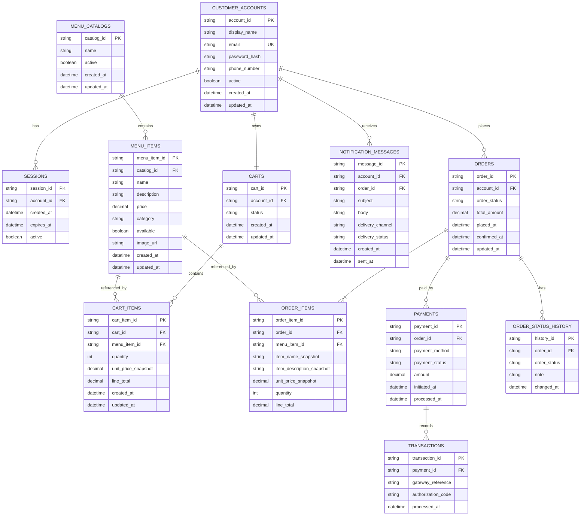

# ERD / Schema Plan

This ERD is derived from the UML class diagram and keeps only the persistent data model needed to support the requirements and use cases.



## ER Diagram



# ERD Explanation and Design Notes

This ERD models the database structure for the food ordering system.  
The design focuses only on information that needs to be stored permanently inside the database.

The schema is organized around the main flow of the application:

```text
Customer → Menu → Cart → Order → Payment → Tracking → Notifications
```

Each table is responsible for storing a specific part of that process.

---


## CUSTOMER_ACCOUNTS

This table stores customer identity and account information.

It is responsible for:
- registration
- login credentials
- account status
- contact information

Example stored data:
- email
- password hash
- phone number
- display name

This acts as the central user table of the system.

---

## SESSIONS

This table stores active login sessions.

A session is created when a customer logs in and is used to:
- keep the user authenticated
- track login expiration
- support logout and timeout behavior

This separation improves security and session management.

---

## MENU_CATALOGS

This table groups menu items into catalogs.

Examples:
- Breakfast Menu
- Dinner Menu
- Seasonal Menu

In a simple deployment, only one catalog may exist.  
However, keeping this table makes the system easier to expand later.

---

## MENU_ITEMS

This table stores the actual food products shown to customers.

Example items:
- Burger
- Pizza
- Pasta

Each item stores:
- name
- description
- price
- category
- availability
- image URL

This represents the live restaurant menu.

---

## CARTS

This table stores a customer’s active shopping cart.

The cart acts as temporary storage before checkout.

It allows customers to:
- add items
- remove items
- update quantities
- prepare an order before payment

The system supports one active cart per customer.

---

## CART_ITEMS

This table stores the individual items inside a cart.

Each row represents:
- one selected menu item
- its quantity
- pricing information

Example:

| Cart | Item | Quantity |
|---|---|---|
| Cart #1 | Burger | 2 |

This table creates the relationship between carts and menu items.

---

## ORDERS

This table stores finalized customer purchases.

An order is created when checkout is completed.

The table stores:
- order status
- total amount
- timestamps
- customer reference

Unlike carts, orders are permanent business records.

---

## ORDER_ITEMS

This table stores the items that belong to a completed order.

It is separated from `CART_ITEMS` because:
- cart contents may change
- completed orders must remain historically accurate

Snapshot fields are stored here so old orders do not change if:
- menu prices change
- item names change
- descriptions are updated later

This is important for consistency and auditing.

---

## PAYMENTS

This table stores payment attempts and payment state information.

It includes:
- payment method
- payment status
- amount
- processing timestamps

The system may store multiple payment attempts for the same order if:
- retries occur
- a payment initially fails

---

## TRANSACTIONS

This table stores transaction data returned from external payment providers.

Examples:
- Stripe
- PayPal
- Fawry

Stored information may include:
- authorization codes
- gateway references
- processing timestamps

This table improves:
- payment auditing
- debugging
- retry handling

---

## ORDER_STATUS_HISTORY

This table stores the history of order status changes.

Instead of storing only the current status, the system keeps a timeline of updates.

Example timeline:

| Time | Status |
|---|---|
| 7:00 PM | PENDING |
| 7:05 PM | PREPARING |
| 7:20 PM | OUT_FOR_DELIVERY |

This supports:
- order tracking
- customer transparency
- delivery progress history

---

## NOTIFICATION_MESSAGES

This table stores notifications sent to customers.

Examples:
- order confirmation emails
- payment confirmations
- delivery updates

The system can track:
- message content
- delivery status
- send timestamps

This improves reliability and customer communication.

---

# Relationship Explanation

The relationships in the ERD describe how data connects together.

## Customer Relationships

A customer can:
- create many sessions over time
- place many orders
- receive many notifications

However, each customer has only one active cart.

---

## Cart Relationships

A cart contains many cart items.

Each cart item references exactly one menu item.

This allows customers to select multiple products and quantities before checkout.

---

## Order Relationships

An order contains:
- many order items
- many status history records

This supports:
- multi-item purchases
- detailed order tracking

---

## Payment Relationships

An order may contain multiple payment attempts.

This allows the system to preserve:
- failed payments
- retries
- recovery attempts

A payment may also contain multiple transactions if the payment gateway separates:
- authorization
- capture
- settlement

---

# Constraints and Data Integrity

The schema includes rules to keep stored data valid and consistent.

---

## Unique Constraints

Some values must always be unique.

Examples:
- email addresses
- order IDs
- payment IDs

This prevents duplicate records.

---

## NOT NULL Constraints

Important fields should never be empty.

Examples:
- email
- password hash
- item name
- payment amount

This ensures required business data always exists.

---

## Numeric Validation

Numeric values should be restricted to valid ranges.

Examples:

```sql
quantity > 0
price >= 0
amount >= 0
```

This prevents invalid business data such as:
- negative prices
- zero quantities

---

## Indexing

Indexes improve database query performance.

Examples:
- searching menu items
- loading order history
- tracking order status changes

Without indexes, large databases become slower over time.