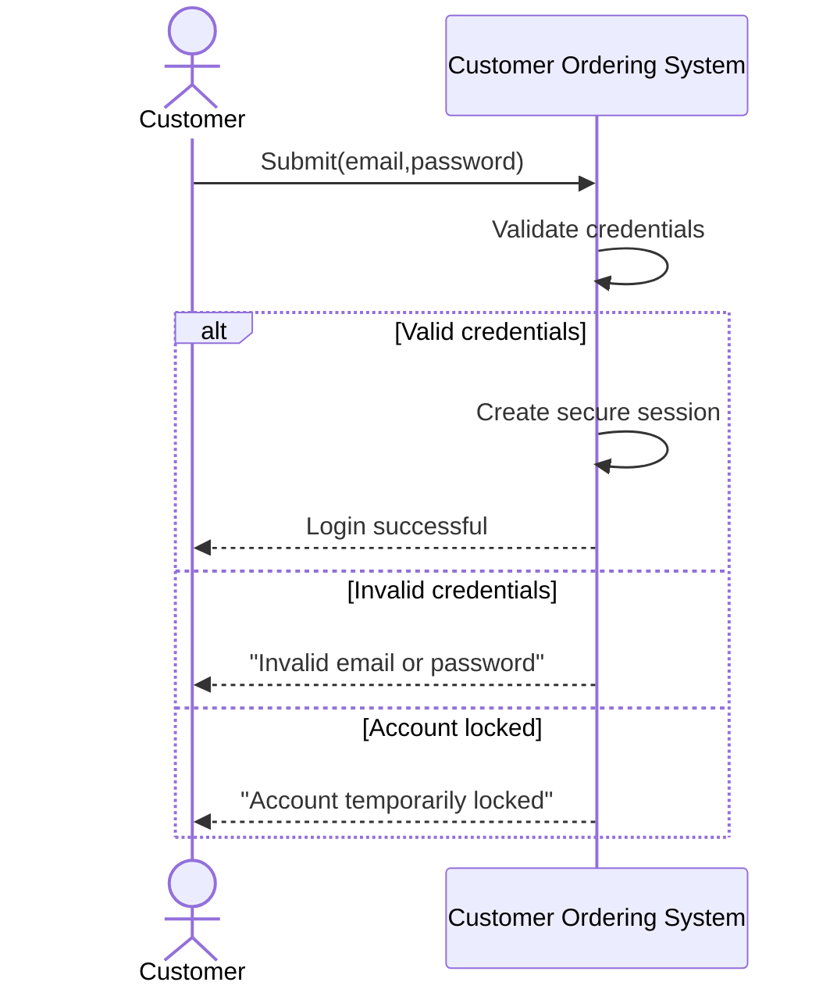
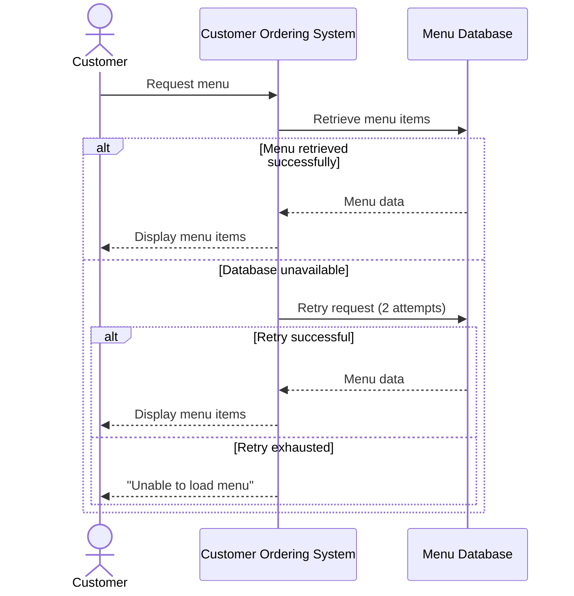
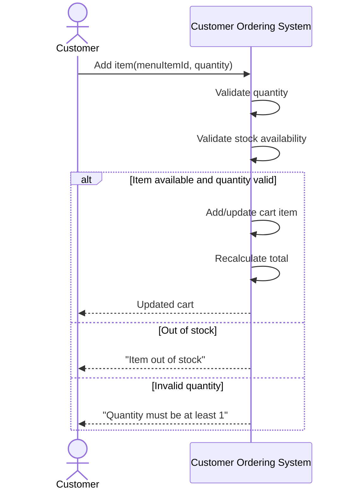
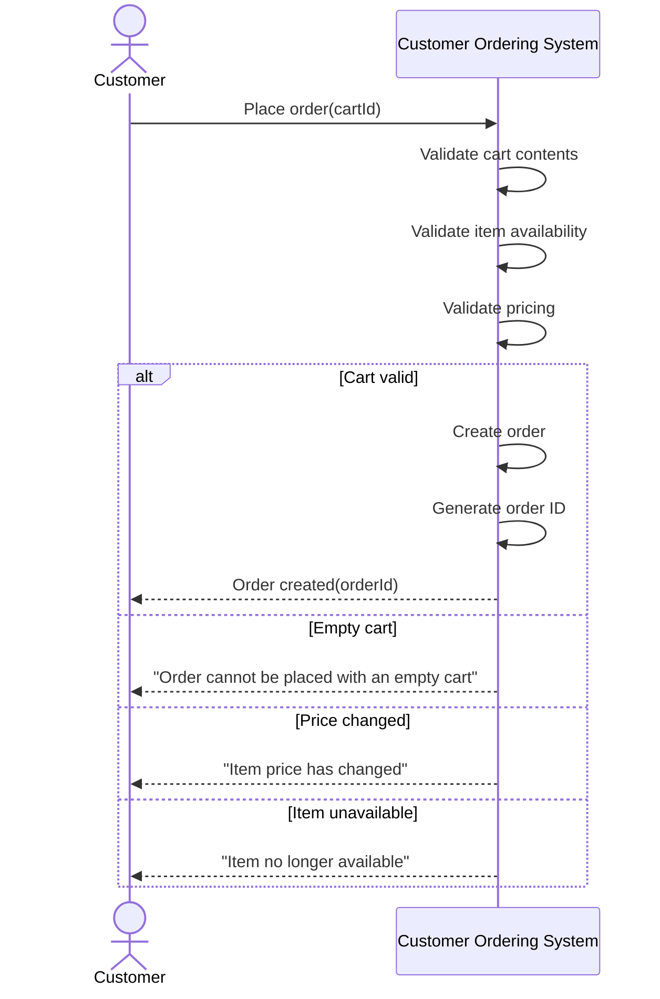
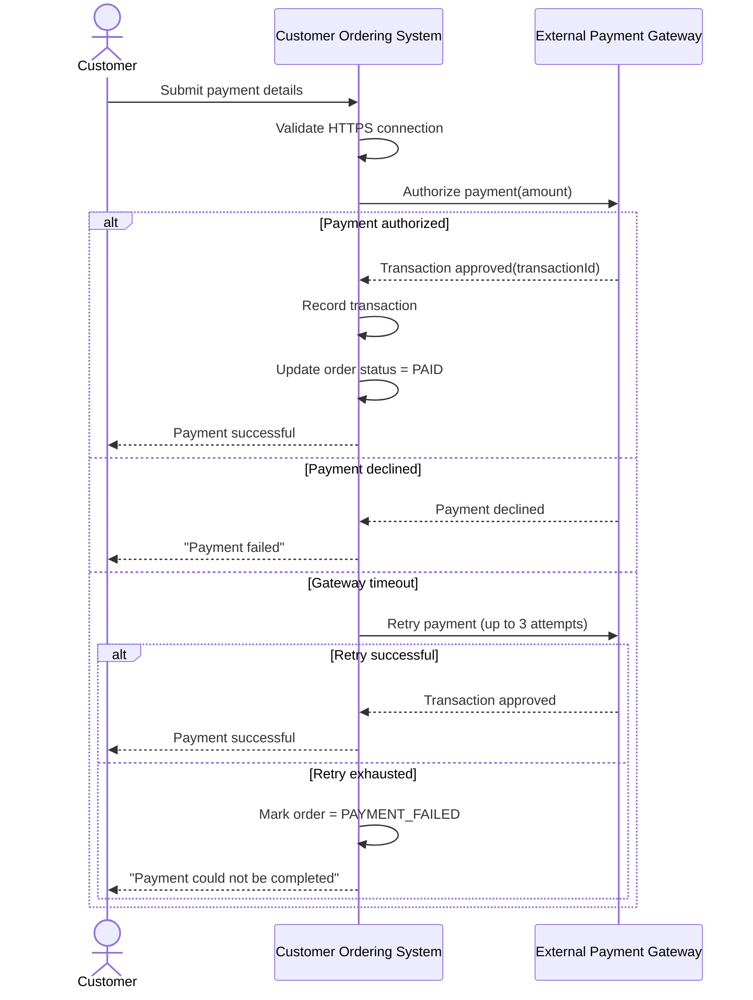
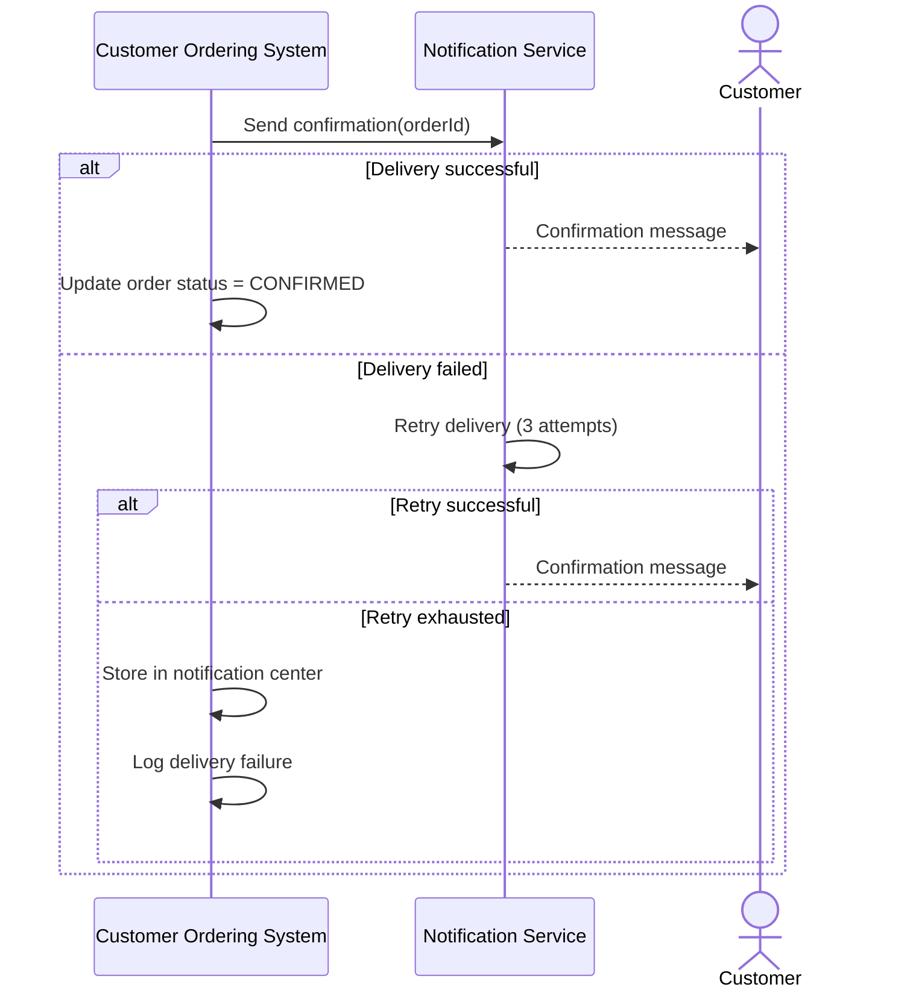
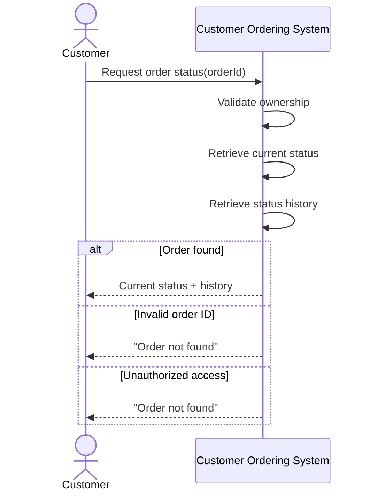

# System Sequence Diagrams (SSD)

This document provides the System Sequence Diagrams (SSD) for the Customer Ordering System.

The SSDs describe:

* external actors
* interactions with the system
* system responses
* alternate and failure flows

The diagrams are derived from:

* requirements and use cases
* UML class diagram
* edge case analysis

---

# SSD-UC1 — Authentication

---

# SSD-UC2 — Browse Menu

---

# SSD-UC3 — Manage Cart

---

# SSD-UC4 — Place Order

---

# SSD-UC5 — Process Payment

---

# SSD-UC6 — Send Confirmation

---

# SSD-UC7 — Track Order

---

# Design Notes

## Purpose of SSDs

The System Sequence Diagrams describe:

* how actors interact with the system
* the order of operations
* major validation points
* failure handling behavior

Unlike class diagrams, SSDs focus on runtime interaction flow rather than internal structure.

---

## Relationship to Requirements

Each SSD corresponds directly to a use case:

* UC1 → Authentication
* UC2 → Browse Menu
* UC3 → Manage Cart
* UC4 → Place Order
* UC5 → Process Payment
* UC6 → Send Confirmation
* UC7 → Track Order

This preserves traceability between:

* requirements
* behavior
* implementation

---

## Relationship to Edge Cases

Alternative and failure flows were derived from the Edge Case Analysis document.

Examples include:

* invalid credentials
* out-of-stock items
* payment gateway timeout
* duplicate requests
* unauthorized order access

These flows improve reliability, security, and operational correctness.
