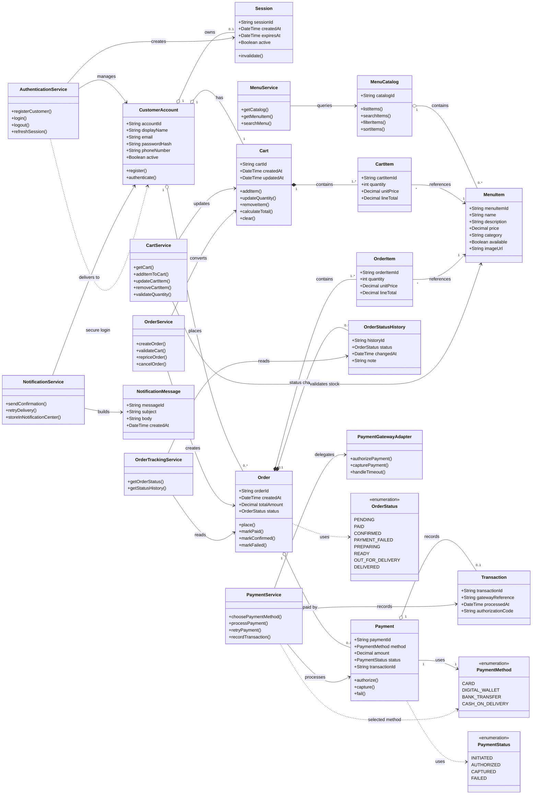

# Class Diagram

# Why These Components Exist

This class diagram is designed to separate the system into smaller responsibilities so each part of the food ordering system has a clear purpose. Instead of putting all logic into one large class, the design divides the system into focused components that are easier to understand, maintain, and extend.

---

## Customer and Authentication Components

`CustomerAccount`, `Session`, and `AuthenticationService` manage user identity and login behavior.

- `CustomerAccount` stores customer information such as email, password hash, and phone number.
- `Session` represents an active login session and handles expiration/logout behavior.
- `AuthenticationService` performs operations such as registration, login, and session management.

This separation keeps authentication logic organized and improves security.

---

## Menu Components

`MenuCatalog`, `MenuItem`, and `MenuService` are responsible for browsing food items.

- `MenuCatalog` represents the complete restaurant menu.
- `MenuItem` represents a single product such as a burger or pizza.
- `MenuService` handles searching, filtering, and retrieving menu data.

Separating menu data from menu operations makes the system easier to update and scale.

---

## Cart Components

`Cart`, `CartItem`, and `CartService` manage temporary shopping activity before checkout.

- `Cart` represents the customer’s current shopping cart.
- `CartItem` stores item quantity and pricing information.
- `CartService` contains the business logic for adding, updating, and removing items.

The cart is separated from orders because cart contents can change frequently before purchase confirmation.

---

## Order Components

`Order`, `OrderItem`, `OrderStatus`, `OrderStatusHistory`, and `OrderService` handle finalized purchases.

- `Order` represents a completed checkout request.
- `OrderItem` stores a permanent snapshot of purchased items.
- `OrderStatus` defines the current stage of the order.
- `OrderStatusHistory` stores all previous status updates for tracking purposes.
- `OrderService` validates carts and creates orders.

This design supports order tracking and prevents historical purchase data from changing after checkout.

---

## Payment Components

`Payment`, `Transaction`, `PaymentMethod`, `PaymentService`, and `PaymentGatewayAdapter` handle payment processing.

- `PaymentMethod` defines available payment options such as card or cash on delivery.
- `Payment` stores payment information and status.
- `Transaction` stores the response returned from the payment provider.
- `PaymentService` controls payment flow and retry logic.
- `PaymentGatewayAdapter` communicates with external payment systems such as Stripe or PayPal.

The adapter layer is important because it isolates external APIs from the rest of the system. If the payment provider changes later, the main system architecture remains stable.

---

## Notification Components

`NotificationMessage` and `NotificationService` manage customer notifications.

- `NotificationMessage` stores notification content.
- `NotificationService` sends confirmations and retries failed deliveries.

This keeps communication logic separate from ordering and payment logic.

---

## Tracking Components

`OrderTrackingService` and `OrderStatusHistory` provide order tracking functionality.

- Customers can view the current order state.
- The system can display a timeline of status updates such as:
  - Pending
  - Preparing
  - Out for Delivery
  - Delivered

This improves transparency and user experience.

---

# Design Notes

## Separation Between Data and Logic

The design separates:

- data classes (`Order`, `Cart`, `Payment`)
- service classes (`OrderService`, `CartService`, `PaymentService`)

Entity classes mainly store information, while service classes perform business operations. This follows common backend architecture practices and keeps the system modular.

---

## Why `CartItem` and `OrderItem` Are Different

Although they look similar, they serve different purposes:

- `CartItem` is temporary and changes while the customer edits the cart.
- `OrderItem` becomes permanent once the order is placed.

This prevents old orders from changing if menu prices are updated later.

---