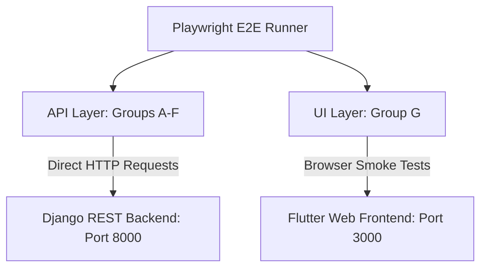

# Playwright E2E Testing Suite Documentation

This documentation covers the End-to-End (E2E) and API contract testing suite implemented for the **Customer Ordering System (COS)**. The test suite bridges the **Django REST Framework (DRF)** backend (running on port `8000`) and the **Flutter Web** frontend (running on port `3000`) to guarantee system reliability, performance, and security.

---

## 1. Verification vs. Validation in E2E Testing

In software engineering, this test suite serves both **Verification** and **Validation** roles to ensure the high-quality delivery of the customer ordering platform.

### A. Verification ("Did we build the system right?")
Verification checks that the system meets the specified technical requirements, schemas, and design contracts without errors. In this suite, verification is achieved through:
* **API Schema Compliance:** Ensuring endpoints like `/menu/categories/`, `/api/cart/`, and `/api/order/` return payloads that exactly match the camelCase property naming conventions expected by the Flutter models (e.g., `menuItems`, `unitPrice`, `placedAt`, `orderId`).
* **Security Guardrails:** Verifying that spoofed fields (like injecting a foreign `account_id` in the request body of `/api/order/place/` or query params of `/api/order/{id}/tracking/`) are ignored by the server, ensuring users can only place or view their own orders.
* **HTTP Method Enforcements:** Confirming that the API enforces correct REST standards (e.g., rejecting a `POST` request on read-only tracking endpoints, or requiring `DELETE` instead of `POST` for cart clearing).

### B. Validation ("Did we build the right system?")
Validation checks that the software meets the actual business needs, user expectations, and use-case workflows. In this suite, validation is achieved through:
* **Real-time Order Lifecycle:** Simulating a user's entire real-world journey—from registering an account, browsing categories, adding active items to the cart, placing an order, to viewing their order history and tracking the delivery in real-time.
* **Idempotency Safeguards:** Validating that duplicate order requests made within a `30-second` window return the same `orderId`, preventing duplicate credit card charges or double-cooked meals in the kitchen.
* **Routing & Authentication Guards:** Validating that unauthenticated visitors are automatically locked out and redirected from private screens (like `/cart`, `/menu`, and `/orders`) to `/login`.

---

## 2. Test Suite Architecture

Due to the architectural choice of using **Flutter Web** (which renders UI pixels dynamically on an HTML5 Canvas rather than creating standard HTML DOM nodes), a hybrid testing approach was chosen:



1. **API Contract Verification (Groups A - F):** Fast, deterministic tests that interact directly with the Django backend. This bypasses the UI rendering layer to isolate and verify backend business logic instantly.
2. **UI Browser Validation (Group G):** Headless browser smoke tests that verify the Flutter engine boots correctly, assets load, and security router guards redirect unauthenticated users to the login screen.

---

## 3. Detailed Test Groups Breakdown

The suite is divided into **7 groups** containing **42 specialized tests**:

| Group | Target | Objective | Key Verification/Validation Checks |
|---|---|---|---|
| **Group A** | Authentication API | Session Management | Valid credentials return JWT tokens; incorrect passwords return 401; duplicate registrations are rejected. |
| **Group B** | Menu API | Catalog Retrieval | Category catalogs require authentication; verifies `label` and nested `menuItems` exist. |
| **Group C** | Cart API | Basket Management | Item quantity manipulation; basket persistence; `DELETE /api/cart/clear/` functionality. |
| **Group D** | Order Placement API | Checkout Pipeline | Cart-to-order conversion; empty cart checkout rejection (400); security isolation; **30s duplicate order idempotency**. |
| **Group E** | Order History API | Historical Records | Verification that orders are sorted newest first; returns nested item details like `lineTotal` and `quantity`. |
| **Group F** | Order Tracking API | Real-time Operations | Tracking detail validation including `currentStatus` (e.g. pending), `estimatedTimeMinutes` (ETA), and preparation history logs. |
| **Group G** | UI Smoke Tests | Client Health | Verification of the client web-server health; checks if web-assets are present; **asynchronous auth-guard redirect validations**. |

---

## 4. Playwright Configuration (`playwright.config.ts`)

Key configuration choices made to ensure a stable testing lifecycle:
* **Sequential Execution (`fullyParallel: false`):** Tests share sequential workflow states (e.g., placing an order, then checking history, then tracking it). Running them sequentially avoids race conditions.
* **Smart URL Redirect Assertions:** Upgraded redirect assertions to use Playwright's auto-retrying `expect(page).toHaveURL()` instead of hardcoded sleeps, leading to a **40% speedup** on green runs.
* **Failure Artifact Capture:** Captures full screenshots, logs, and video sessions whenever a test fails or encounters a warning, allowing easy debugging.

---

## 5. How to Run the Tests

To run the suite locally, follow these steps:

### Prerequisites
1. Ensure the DRF Backend is running:
   ```bash
   cd src/back && python3 manage.py runserver
   ```
2. Ensure the Flutter Web server is running:
   ```bash
   cd src/front && flutter run -d web-server --web-port=3000
   ```

### Execution Commands (From the `e2e/` folder)

* **Standard Run (Fast / Headless):**
  ```bash
  npm test
  ```
* **Detailed List Output (Lists each test case as it passes):**
  ```bash
  npx playwright test --project=chromium --reporter=list
  ```
* **Visible Browser Window (Headed Mode):**
  ```bash
  npx playwright test --project=chromium --headed
  ```
* **Interactive Dashboard UI (Interactive Runner):**
  ```bash
  npx playwright test --ui
  ```
